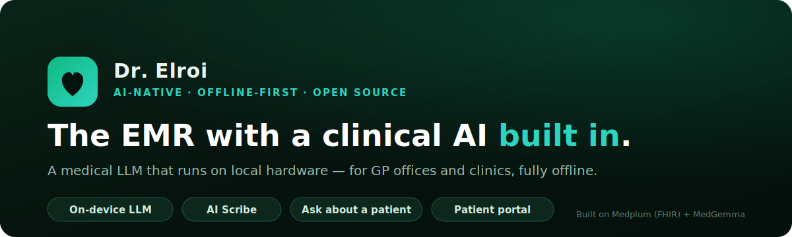

# Dr. Elroi 🩺🤖



### 🌐 Live showcase → **[dr-elroi-demo.vercel.app](https://dr-elroi-demo.vercel.app)**

**An AI-native, offline-first EMR/EHR for primary care.** Dr. Elroi reimagines the electronic medical
record around a clinical AI that is *built in* — not bolted on — and runs **entirely on local hardware**,
so it works in a GP office, a rural clinic, or a busy medical plaza even with no internet, and patient
data never leaves the building.

Built by the **Africa Digital Health Academy** for the realities of African primary care, and designed
to generalise to any small practice that wants a modern, AI-assisted record.

> **Vision:** the EMR where the AI is the assistant *inside* the chart — it listens, drafts, summarises,
> and surfaces what matters for *this* patient, while the clinician stays in control of every decision.

---

## Why it's different

- 🧠 **A clinical LLM, on-device.** [MedGemma](https://huggingface.co/google/medgemma-4b-it) runs locally
  via [Ollama](https://ollama.com/) — no cloud, no per-token bill, no data egress.
- 🎙️ **AI Scribe.** Dictate a visit; Dr. Elroi drafts structured FHIR resources for the clinician to
  review and approve before anything is saved.
- 💬 **Ask about a patient.** Pull up a record and ask in plain language — summaries, history, medication
  and allergy checks — grounded only in that patient's data.
- 🗣️ **Voice.** Optional local text-to-speech ([Kokoro](https://github.com/hexgrad/kokoro)) reads answers aloud.
- 🔐 **Role-based + patient portal.** Admin / developer / doctor roles, per-doctor patient scoping, and a
  patient login to view their own record, message their GP, and request refills.
- 📴 **Offline-first by design.** PostgreSQL, cache, AI, and EMR all run on one machine.

Dr. Elroi builds on the excellent open-source [Medplum](https://www.medplum.com/) FHIR platform and adds
the AI connector, the clinician/patient experience, and the local-first packaging.

## Architecture (all local)

| Component | Port | Role |
|-----------|------|------|
| PostgreSQL | 5432 | EMR database |
| Memurai / Redis | 6379 | Cache / job queue |
| Ollama + MedGemma | 11434 | Local medical LLM |
| Kokoro | 8123 | Text-to-speech (Dr. Elroi's voice) |
| Medplum API | 8103 | FHIR backend |
| Medplum web app | 3002 | EMR records / admin + patient portal |
| Clinic app | 3001 | Doctor-facing charting UI |
| **Dr. Elroi connector** | 3300 | Chat + admin panel (`connector/dr-elroi.mjs`) |

## What's in this repository

The Africa Digital Health Academy **product layer** — the dependency-free Dr. Elroi connector, the
launch/seed scripts, config templates, and docs. The third-party stack (the Medplum monorepo, the AI
models, the database, bundled runtimes) is **not** committed — it is large, third-party, or contains
secrets/patient data. See [docs/SETUP.md](docs/SETUP.md) to reproduce the full stack from a clone.

```
connector/        Dr. Elroi connector (dr-elroi.mjs) + helper/seed scripts + avatar
Start/Stop *.ps1  bring the whole local stack up/down in order
config-examples/  placeholder configs (copy + fill in real values)
docs/SETUP.md     reproduce the full stack from scratch
```

## Quick start

1. `cp connector/.env.example connector/.env` and fill in real values (see [docs/SETUP.md](docs/SETUP.md)).
2. Run `Start-DrElroi.ps1` (or `Start Dr. Elroi.bat`).
3. Open the chat at **http://localhost:3300**; the EMR at **http://localhost:3002**.

## ⚠️ Status & safety

Dr. Elroi is an **active project and research/showcase**, not a certified medical device. The AI is
**assistive and human-in-the-loop**: it drafts and surfaces information for a qualified clinician to
review and approve — it does **not** make autonomous clinical decisions, and it must not be used for real
patient care without appropriate clinical validation, governance, and regulatory approval in your
jurisdiction. No secrets or patient data are included in this repository (see `.gitignore`).

## License

Licensed under the [Apache License 2.0](LICENSE). © 2026 Temesgen Endalew / Africa Digital Health Academy.

## Creator

Created by **Dr. Temesgen Endalew** — [LinkedIn](https://www.linkedin.com/in/dr-temesgen-endalew/).
Interested in AI-native EMR/EHR for GP offices and clinics? Reach out.
